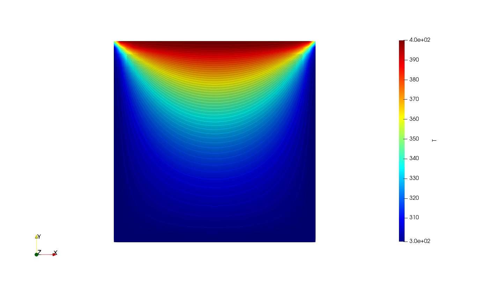

# Diffusion 2D solver for a steady system
First time writing a 2D diffusion solver using Finite Volume Method. I referred to Versteeg and Malalasekara for reference.

# The top plate temp = 400 K and the rest is at room temp = 298 K.

